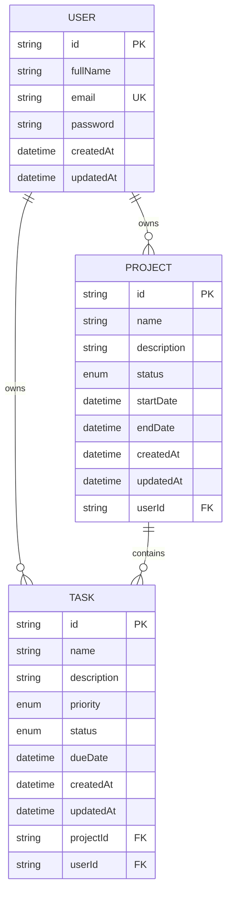

# Database Schema / ER Diagram

## Notes

- Each project belongs to one user.
- Each task belongs to one project and one user.
- Users can view only their own projects and tasks.
- The DB uses Postgres enums for project and task status values.
